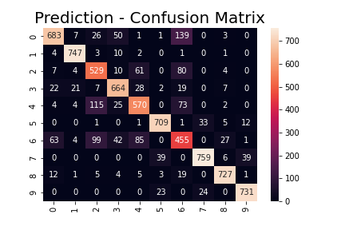

# Deep Learning Homework 1

### Topics

- NumPy Basics
- Classification with Logistic Regression

### Structure

Follow the ipython notebooks with the order given below:

- numpy-basics.ipynb
- logistic-regression.ipynb
  
In each notebook, you will be guided to fill the stated parts. You do not need to and not allowed to import additional packages.

### Installation

To start your homework, you need to install requirements. We recommend that you use [conda](https://docs.conda.io/projects/conda/en/latest/user-guide/install/index.html) environment for this homework.

```
conda create -n dlhw1 python=3.7
conda activate dlhw1
```

You can install requirements with the following command in the homework directory:

```
pip install -r requirements.txt
```

In order to visualize plotly plots in jupyter notebooks, you should run the command given below.

```
conda install nodejs
```

### Docker

You can also use docker to work on your homework instead of following installation steps. Simply, build a docker image in the homework directory using the following command:

```
docker build -t dl_hw1 .
```

You may need to install docker first if you don't have it already.

After building a container, we need to mount the homework directory at your local computer to the container we want to run. Note that the container will install necessary python packages during the build phase.

You can run the container using the command below as long as your current directory is the homework directory:

```
sudo docker run -it --rm -p 8889:8889 -v $PWD:/hw1 dl_hw1
```

This way you can connect the container at ```localhost:8889``` in your browser. Note that, although we are using docker, changes are made in your local directory since we mounted it.

You can also use it interactively by running:

```
sudo docker run -it --rm -p 8889:8889 -v $PWD:/hw1 dl_hw1 /bin/bash
```

## **Results** 

Classification is performed with Logistic Regression and the confusion matrix is reached on the test dataset.



### Related Readings

> [Deep Learning Book - Ian Goodfellow and Yoshua Bengio and Aaron Courville](https://www.deeplearningbook.org/)

- Chapters 3-5
